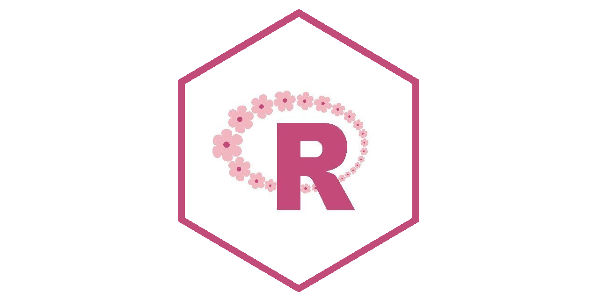
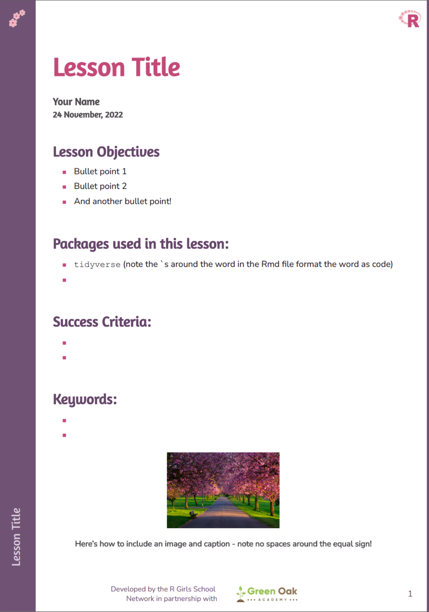
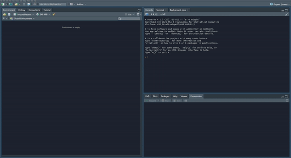

```{r setup, include=FALSE}
knitr::opts_chunk$set(echo = TRUE)
```



This package contains a lesson plan template and some datasets for teaching purposes from RGirls Community. It is intended as a resource for both teachers and pupils, and is developed and maintainted by the RGirls School Network, in partnership with Green Oak Academy. 

## Installation

To download and install the development version of the package, use `devtools`:

```{r, eval = FALSE}
install.packages("devtools")
devtools::install_github("R-Girls/RGirls")
```
Once you've installed the package, you can load the library in the standard way:

```{r}
library(RGirls)
```

## Lesson plan template

We have a lesson plan template which provides a starting point for consistency across our lessons. The template makes use of {pagedown}, and the output looks like this:

<center>
{width=30%}
</center>

To make use of this template, make sure you have the most recent version of the package installed. 

- Click on the new document icon
- Select "RMarkdown Document"
- In the pop up, choose "From a template"
- Select "rgirlspdf" from the list of available templates
- Choose a title for your lesson plan, and a location for it to be saved
- Modify the file as needed
- Save and Knit the file as usual

<center>


</center>


This will produce a PDF as well as an html document within the location you selected. 


### A note on fonts

The easiest way to make use of the fonts in the template is to make sure you have access to the internet while knitting your lesson plan. The package works by calling the Google Fonts API to load the fonts. 

If you prefer to work offline, you can install the fonts, and the package will find them in the repo. To do this, you need to navigate to the `assets/fonts/` folder inside the package (look for the `RGirls` folder within your normal R library location), right click on the font files and select "Install for all Users". 

### RGirls colours

The colours used in the template are saved for easy reuse in graphs, if you want to create graphs with matching colours:

```{r}
rgirls_colours()
```


## Datasets

The current data available from the package is data of ruler drop test reaction time, called `reactionData`. This test uses the known properties of gravity to determine how long it takes a person to respond to the dropping of an object by measuring how far the object can fall before being caught. This data was collected from students before and after drinking coke.


**Basic usage:**
```r
reactionData

# A tibble: 103 × 4
   student  test time_before time_after
   <chr>   <dbl>       <dbl>      <dbl>
 1 Amy         1       0.207      0.163
 2 Amy         2       0.221      0.181
 3 Amy         3       0.136      0.175
 4 Amy         4       0.197      0.15 
 5 Amy         5       0.111     NA    
 6 Betty       1       0.3        0.128
 7 Betty       2       0.239      0.273
 8 Betty       3       0.175      0.217
 9 Betty       4       0.26       0.275
10 Carol       1       0.186      0.207
# … with 93 more rows
# ℹ Use `print(n = ...)` to see more rows
```

## Contributing :two_hearts:

- If you like it, leave your star in this project :star2:
- If you would like to report a bug/complain/suggest/contribute to this project, feel free to [open a issue](https://github.com/R-Girls/RGirls/issues) :heart_decoration:
- Please follow our [contributing guidelines](). 

## License

This work is licensed under a
[Creative Commons Attribution 4.0 International License][cc-by].

[![CC BY 4.0][cc-by-image]][cc-by]

[cc-by]: http://creativecommons.org/licenses/by/4.0/
[cc-by-image]: https://i.creativecommons.org/l/by/4.0/88x31.png
[cc-by-shield]: https://img.shields.io/badge/License-CC%20BY%204.0-lightgrey.svg


### Work in progress

- FAIRfication of the package
- Add citation
- Add contributing guidelines

